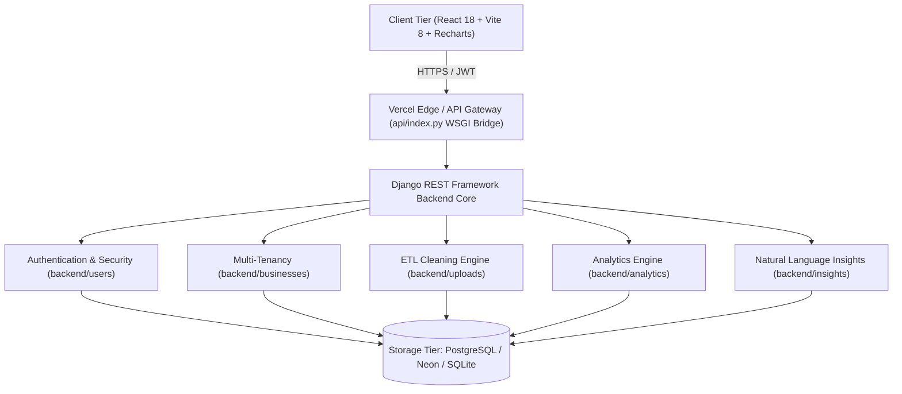

# BizLens — Platform Architecture & Functional Reference Guide

---

## 1. Executive Summary & Platform Overview

**BizLens** is a multi-tenant, cloud-native Business Intelligence (BI) and Financial Analytics platform. It transforms raw transactional business data (sales ledgers, expense sheets, invoices) into executive financial KPIs, predictive insights, and automated root-cause diagnostics.

### Core Problems Solved:
1. **Automated Data Cleaning**: Ingests messy, real-world CSV files and executes multi-stage data sanitization (deduplication, date parsing, negative value filtering, quality scoring).
2. **Financial KPI Calculation**: Automatically calculates Gross Revenue, Net Profit, Profit Margin %, Average Order Value (AOV), and Period-over-Period (PoP) growth.
3. **Automated Root-Cause Diagnostics**: Algorithms compute month-over-month variance to pinpoint the exact products, regions, and cost spikes responsible for profit changes.
4. **RFM Customer Segmentation**: Categorizes customers into behavioral tiers (VIP, High-Value, Regular, At-Risk, Churned) to prevent revenue leakage.
5. **Multi-Tenant SaaS Isolation**: Ensures complete data segregation across different organizations and business branches.
6. **Security & Audit Logging**: Tracks every authentication attempt with IP address, device fingerprints, and success/failure status.

---

## 2. System Architecture

---

## 3. Comprehensive Breakdown of Core Functions

### A. Authentication & Security (`backend/users/`)

#### 1. `get_client_ip(request)`
* **File**: `backend/users/views.py`
* **Significance**: Identifies the real client IP address even when deployed behind reverse proxies, CDNs, or load balancers (such as Cloudflare or Vercel Edge).
* **Input**: HTTP request object.
* **Output**: Client IP string (e.g. `192.168.1.1` or `2409:...`).
* **Logic**: Reads `HTTP_X_FORWARDED_FOR` header first; if absent, falls back to `REMOTE_ADDR`.

#### 2. `LoginView.post(request)`
* **File**: `backend/users/views.py`
* **Significance**: Primary authentication gatekeeper. Validates user credentials, issues JWT access and refresh tokens, and generates an audit log record for every attempt.
* **Input**: JSON payload `{ "email": "...", "password": "..." }`.
* **Output**: HTTP 200 with JWT tokens and user profile, or HTTP 401 Unauthorized with error detail.
* **Audit Recording**: Automatically creates a `LoginRecord` entry in the database specifying whether the login was `SUCCESS` or `FAILED` (with reason: *Account does not exist*, *Incorrect password*, or *Missing credentials*).

#### 3. `LoginHistoryView.get(request)`
* **File**: `backend/users/views.py`
* **Significance**: Admin-only audit inspection endpoint. Enforces role-based access control so that **only superusers and staff members can view login histories**.
* **Access Control**: Evaluates `permissions.IsAdminUser`. Returns HTTP 403 Forbidden to regular users.
* **Output**: Array of login attempt logs with timestamp, IP, device information, and authentication status.

---

### B. Multi-Tenancy & Isolation (`backend/businesses/`)

#### 1. `IsBusinessMember.has_permission(request, view)`
* **File**: `backend/businesses/permissions.py`
* **Significance**: Guarantees multi-tenant data segregation. Ensures that a user cannot query or modify sales, expenses, or datasets belonging to another company.
* **Logic**:
  1. Inspects the `X-Business-ID` header (or session/query parameter).
  2. Verifies that the authenticated user holds an active `BusinessMembership` for that specific company.
  3. Attaches `request.business` directly to the request context for downstream views.

#### 2. `BusinessListCreateView.get_queryset(self)`
* **File**: `backend/businesses/views.py`
* **Significance**: Lists all companies/organizations that the authenticated user belongs to (supporting owners, partners, and accountants who manage multiple businesses).

---

### C. Data Ingestion & Automated Cleaning Engine (`backend/uploads/`)

#### 1. `validate_csv_columns(df, dataset_type)`
* **File**: `backend/uploads/validators.py`
* **Significance**: Schema integrity validation. Verifies that uploaded CSV files contain required column headers before initiating database writes.
* **Required Columns for SALES**: `Date`, `Product`, `Customer`, `Region`, `Quantity`, `UnitPrice`, `Revenue`.
* **Required Columns for EXPENSES**: `Date`, `Category`, `Vendor`, `Amount`.

#### 2. `process_sales_csv(file_obj, business)`
* **File**: `backend/uploads/cleaners.py`
* **Significance**: In-memory ETL (Extract, Transform, Load) pipeline for sales data.
* **5-Stage Execution**:
  1. **Deduplication**: Drops exact duplicate rows using Pandas (`df.drop_duplicates()`).
  2. **String Standardization**: Strips leading/trailing whitespace from text fields (product names, customer codes, regions).
  3. **Numeric Coercion**: Converts strings to floating-point numbers; replaces malformed currency symbols ($ or ₹) with standard floats.
  4. **Date Parsing**: Parses inconsistent date formats (`DD-MM-YYYY`, `YYYY-MM-DD`) into ISO standard dates.
  5. **Invalid Record Pruning & Quality Scoring**: Discards rows with negative revenues or non-positive quantities. Calculates `quality_score = (valid_records / total_records) * 100`.
* **Atomic Ingestion**: Wraps database creation in `transaction.atomic()` to prevent partial or corrupted imports.

#### 3. `process_expenses_csv(file_obj, business)`
* **File**: `backend/uploads/cleaners.py`
* **Significance**: Parallel ETL pipeline for operational expenditures (OPEX). Standardizes categories (Marketing, Payroll, Utilities, Rent, Logistics) and imports cleaned records.

---

### D. Financial Analytics & Diagnostic Algorithms (`backend/analytics/`)

#### 1. `calculate_revenue_metrics(business, start_date, end_date)`
* **File**: `backend/analytics/revenue.py`
* **Significance**: Calculates core top-line metrics and monthly trends.
* **Computed Outputs**:
  * **Total Revenue**: Sum of all sales revenues (`Sum('total_amount')`).
  * **Total Orders**: Count of transactions.
  * **Average Order Value (AOV)**: $\frac{\text{Total Revenue}}{\text{Total Orders}}$.
  * **Monthly Revenue Trend**: Grouped by month using `TruncMonth('date')`.
  * **Period-over-Period (PoP) Growth %**:
    $$\text{Growth} = \frac{\text{Revenue}_{\text{current}} - \text{Revenue}_{\text{previous}}}{\text{Revenue}_{\text{previous}}} \times 100$$
  * **Regional Breakdown**: Sales distribution across geographical territories.

#### 2. `calculate_expense_metrics(business, start_date, end_date)`
* **File**: `backend/analytics/expenses.py`
* **Significance**: Calculates cost structure and bottom-line profitability.
* **Computed Outputs**:
  * **Total Expenses**: Sum of all operational costs.
  * **Net Profit**: $\text{Total Revenue} - \text{Total Expenses}$.
  * **Profit Margin %**:
    $$\text{Margin} = \left(\frac{\text{Net Profit}}{\text{Total Revenue}}\right) \times 100$$
  * **Category Breakdown**: Percentage distribution of spending (e.g., Marketing vs. Payroll).

#### 3. `calculate_customer_analytics(business)`
* **File**: `backend/analytics/customers.py`
* **Significance**: Implements **RFM (Recency, Frequency, Monetary)** behavioral customer segmentation.
* **Tiers Computed**:
  * **VIP**: High spend ($\ge 100,000$), frequent purchases ($\ge 3$), recent activity ($\le 60\text{ days}$).
  * **High Value**: Significant spend ($\ge 50,000$), active within $90\text{ days}$.
  * **Regular**: Steady purchasers within $90\text{ days}$.
  * **At-Risk**: No purchases in $91\text{ to }180\text{ days}$.
  * **Churned**: Inactive for $>180\text{ days}$.

#### 4. `calculate_product_analytics(business)`
* **File**: `backend/analytics/products.py`
* **Significance**: Calculates product-level performance and Pareto distribution (identifying which top 20% of catalog items generate 80% of revenue).

#### 5. `perform_root_cause_analysis(business)`
* **File**: `backend/analytics/root_cause.py`
* **Significance**: The diagnostic brain of BizLens. Automatically explains **why** performance changed between the last two operational periods without requiring manual data analysis.
* **Algorithm Details**:
  1. Computes total revenue delta ($\Delta \text{Revenue} = R_{\text{curr}} - R_{\text{prev}}$).
  2. Evaluates product-level variance ($\Delta P_i = P_{i,\text{curr}} - P_{i,\text{prev}}$) to identify the single largest declining product.
  3. Evaluates regional variance ($\Delta \text{Region}_j$) to pinpoint which geographical market underperformed.
  4. Generates an executive headline, key contributing factor, and actionable bullet takeaways.

---

### E. AI Business Intelligence Engine (`backend/insights/`)

#### 1. `AskBusinessInsightView.post(request)`
* **File**: `backend/insights/views.py`
* **Significance**: Conversational business query assistant. Allows business owners to ask questions in plain English and receive instant, data-backed financial answers.
* **Examples**:
  * *"Why did sales fall this month?"* $\rightarrow$ Executes Root-Cause Analysis and returns exact product/market drivers.
  * *"Who are my best products?"* $\rightarrow$ Returns top product name, revenue, and catalog revenue share %.
  * *"Which customers are at risk?"* $\rightarrow$ Returns count of At-Risk/Churned accounts and recurring revenue preservation advice.
  * *"What should I focus on next?"* $\rightarrow$ Synthesizes inventory advice for top sellers with customer retention recommendations.

---

### F. Serverless Production Gateway (`api/index.py`)

#### 1. `handler(environ, start_response)`
* **File**: `api/index.py`
* **Significance**: The serverless runtime adapter for Vercel.
* **Key Mechanisms**:
  * **Dynamic Path Resolution**: Scans filesystem candidates (`/var/task/backend`, etc.) so Django modules are discovered regardless of container unpacking location.
  * **Path Normalization**: Restores the true requested path from `HTTP_X_FORWARDED_URI` to prevent Vercel's rewrite engine from setting `PATH_INFO` to `/api/index.py`.
  * **Self-Healing SQLite Bridge**: Automatically copies pre-migrated `db.sqlite3` to `/tmp/db.sqlite3` on cold start if external Postgres is not configured.
  * **Diagnostic Error Wrapping**: Catches startup or invocation errors and returns the complete Python traceback instead of generic Vercel crash screens.

---

## 4. Frontend Architecture & State Management

| Module | Location | Purpose |
|---|---|---|
| `AuthContext` | `frontend/src/context/AuthContext.tsx` | Manages JWT token lifecycle, session persistence in `localStorage`, user roles, and silent re-authentication. |
| `BusinessContext` | `frontend/src/context/BusinessContext.tsx` | Manages multi-tenant switching and injects the active company ID into subsequent API requests. |
| `api.ts` | `frontend/src/services/api.ts` | Centralized Axios HTTP client with request/response interceptors for Bearer token injection and automated 401 error routing. |
| `LoginAudit.tsx` | `frontend/src/pages/LoginAudit.tsx` | Admin-only dashboard showing real-time security logs, IP addresses, client devices, and authentication attempts. |
| `Sidebar.tsx` | `frontend/src/components/Sidebar.tsx` | Dynamic navigation bar that conditionally displays admin-only links (`Login Records`) based on user permissions. |

---

## 5. Database Schema Reference

| Model | Application | Key Fields | Purpose |
|---|---|---|---|
| `User` | `users` | `email`, `username`, `full_name`, `is_staff`, `is_superuser` | Core user identity with email as unique login identifier. |
| `LoginRecord` | `users` | `email`, `user`, `ip_address`, `user_agent`, `status`, `failure_reason`, `timestamp` | Audit log for tracking all authentication attempts. |
| `Business` | `businesses` | `name`, `industry`, `currency`, `created_at` | Multi-tenant organization profile. |
| `BusinessMembership` | `businesses` | `business`, `user`, `role` (OWNER, ADMIN, ANALYST, VIEWER) | Relates users to businesses with granular access roles. |
| `Sale` | `sales` | `business`, `date`, `product_name`, `customer_code`, `region`, `quantity`, `unit_price`, `total_amount` | Granular transactional revenue record. |
| `Expense` | `expenses` | `business`, `date`, `category`, `vendor`, `amount`, `notes` | Granular operational expenditure record. |
| `Product` | `products` | `business`, `name`, `sku`, `unit_cost`, `unit_price` | Product catalog reference. |
| `Customer` | `customers` | `business`, `customer_code`, `name`, `region` | Customer identity reference. |
| `Dataset` | `uploads` | `business`, `dataset_type`, `file_name`, `status`, `total_records`, `valid_records`, `quality_score` | Tracking history and data hygiene score of uploaded CSVs. |
